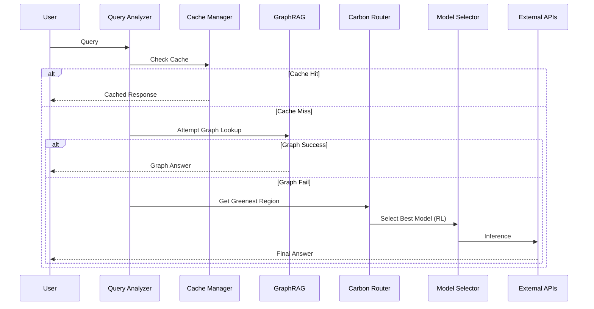

# Architecture Deep Dive 🏗️

CarbonSense AI is built as a highly modular "Micro-Orchestrator" designed to sit between your application and various Large Language Models.

## 📐 High-Level Architecture

The system is designed with a "Reject-Redirect-Reduce" philosophy:
1. **Reject**: Use caching to reject redundant compute.
2. **Redirect**: Redirect queries to the greenest regional compute.
3. **Reduce**: Reduce model size and prompt length to the minimum required.

### Data Flow Diagram

---

## 🧩 Key Components

### 1. Query Analyzer (`app.modules.query_analyzer`)
A lightweight, non-LLM based classifier. It uses regex and keyword matching to determine:
- **Complexity**: Simple vs Complex.
- **Intent**: Creative, Analytical, Transactional.
- **Urgency**: Immediate vs Flexible (critical for carbon routing).

### 2. Cache Manager (`app.modules.cache_manager`)
A two-layer system:
- **L1 (Redis)**: Stores exact query/response pairs.
- **L2 (ChromaDB)**: Stores vector embeddings. If a new query is semantically similar (>93%) to a previous query, the cached result is returned.

### 3. GraphRAG Engine (`app.modules.graph_rag`)
Uses a Neo4j Knowledge Graph to answer factual questions. 
- It extracts entities from the query.
- Traverses relevant paths in the graph.
- If enough information is found, it synthesizes an answer using a tiny LLM, avoiding a call to larger models like GPT-4.

### 4. Carbon Router (`app.modules.carbon_router`)
The heart of the system. It fetches grid carbon intensity (gCO2/kWh) for various regions.
- If the query is "Flexible" urgency, it will wait or route to a region with high solar/wind production.
- Uses a weighted score: `(CarbonWeight * Intensity) + (LatencyWeight * Latency)`.

### 5. RL Optimizer (`app.modules.rl_optimizer`)
A Q-Learning agent that observes the state (Complexity, Energy Mix) and picks an action (Model Name). 
- **Reward Function**: `UserSatisfaction - (CarbonImpact * PenaltyFactor)`.
- Over time, it learns that for "Transaction" queries, a 7B model performs as well as a 70B model but with 10x less carbon.

---

## 🎨 Design Decisions

### Why not use a single large LLM for routing?
We intentionally use lightweight Python heuristics for the initial analysis to avoid the "Inception Problem"—using a high-carbon LLM to decide how to save carbon.

### Semantic Similarity Threshold
We defaulted to `0.93`. Our testing shows this is the "sweet spot" where user satisfaction remains high (4.4+/5) while maximizing cache hits.

### Stateless vs Stateful
The backend is fundamentally stateless, allowing it to scale across multiple instances. All state (Cache, RL Weights, Logs) is maintained in Redis, PostgreSQL, and Neo4j.
